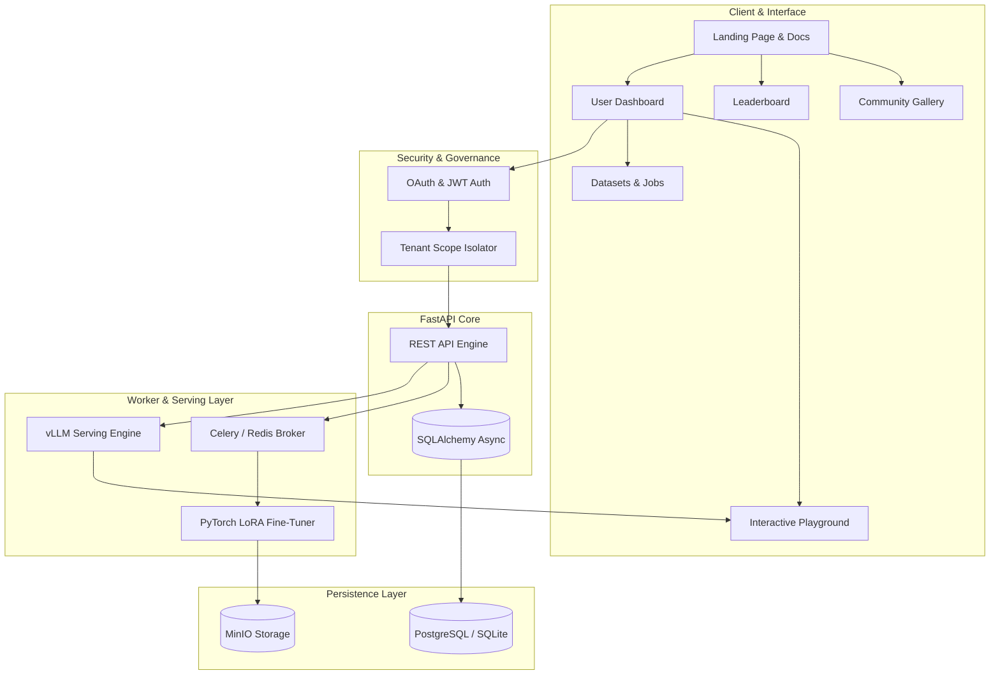

<h1 align="center">ATTESTLY</h1>

<p align="center">
  <strong>Enterprise Open-Weight LLM Fine-Tuning, Privacy-Guaranteed Evaluation & Serving Platform</strong>
</p>

<p align="center">
  <a href="https://nextjs.org"></a>
  <a href="https://fastapi.tiangolo.com"></a>
  <a href="https://www.python.org"></a>
  <a href="https://pytorch.org"></a>
  <a href="https://www.docker.com"></a>
  <a href="https://opensource.org/licenses/MIT"></a>
</p>

---

## Overview

ATTESTLY is an open-source AI platform to securely fine-tune open-weight foundation models (Llama 3.1, Mistral, Qwen 2.5), evaluate model benchmarks, and deploy private REST endpoints with zero vendor lock-in.

---

## System Architecture



---

## Core Features & Capabilities

| Feature | Description | Key Tech / Specs |
| :--- | :--- | :--- |
| **Fine-Tuning Engine** | Parameter-efficient fine-tuning for SOTA models | QLoRA / LoRA (4-bit quantization, 6GB VRAM min) |
| **Multi-Tenant Privacy** | Cryptographic row-level data isolation per user | Cryptographic tenant IDs, strict row scoping |
| **Model Serving** | Deploy fine-tuned models to dedicated endpoints | vLLM / Ollama serving container |
| **Benchmark Leaderboard** | Automated evaluation across standard datasets | MMLU, GSM8K, HumanEval, BioMMLU |
| **Community Gallery** | Share or discover fine-tuned community models | Opt-in visibility, leak detection |
| **API Management** | Dedicated hashed keys for REST inference access | SHA-256 key hashing & rate limiting |

---

## Technical Stack

| Layer | Technology |
| :--- | :--- |
| **Frontend** | Next.js 16 (App Router), React 19, TypeScript, Tailwind CSS |
| **Backend API** | FastAPI 0.109, Python 3.11, Pydantic v2 |
| **Database** | PostgreSQL 16 / SQLite Async, SQLAlchemy |
| **Training & Serving** | PyTorch 2.2, Hugging Face PEFT, vLLM / Ollama |
| **Task Queue** | Celery, Redis 7.2 |
| **Infrastructure** | Docker, Docker Compose, MinIO Object Storage |

---

## Setup & Execution

### 1. Local Development

```bash
git clone https://github.com/avi-071-coder/Attestly.git
cd Attestly
npm install
npm run dev
```

### 2. Docker Deployment

```bash
docker compose up -d --build
```

---

## License

Distributed under the **MIT License**.
