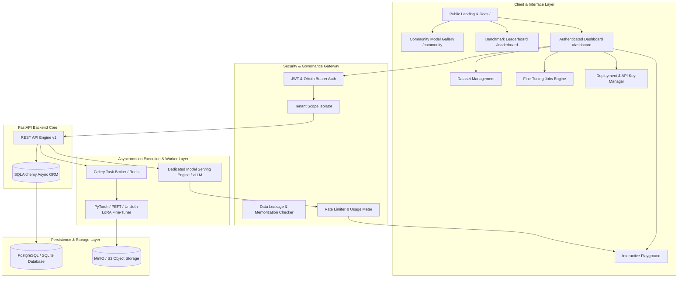

<h1 align="center">ATTESTLY</h1>

<p align="center">
  <strong>Enterprise Open-Weight LLM Fine-Tuning, Privacy-Guaranteed Evaluation & Dedicated Endpoint Serving Platform</strong>
</p>

<p align="center">
  <a href="https://nextjs.org"></a>
  <a href="https://fastapi.tiangolo.com"></a>
  <a href="https://www.python.org"></a>
  <a href="https://pytorch.org"></a>
  <a href="https://www.postgresql.org"></a>
  <a href="https://redis.io"></a>
  <a href="https://www.docker.com"></a>
  <a href="https://tailwindcss.com"></a>
  <a href="https://opensource.org/licenses/MIT"></a>
</p>

---

## Executive Overview

**ATTESTLY** is an industrial-grade, open-source AI platform engineered to bring enterprise-level security, fine-tuning parameter control, and dedicated inference serving to open-weight large language models (LLMs).

With zero vendor lock-in, ATTESTLY allows organizations and researchers to upload domain-specific datasets (`JSONL`, `CSV`, `Parquet`), fine-tune SOTA foundation models (Llama 3.1, Mistral, Qwen 2.5, Phi-3.5, Gemma 2, DeepSeek) using 4-bit QLoRA/LoRA techniques, run automated benchmark evaluations, and serve rate-limited, private REST endpoints.

---

## System Architecture



---

## Enterprise Security & Privacy Guardrails

Security and privacy are non-negotiable foundations of the ATTESTLY architecture. Unlike generic AI wrappers, ATTESTLY guarantees multi-tenant mathematical isolation and explicit data publishing controls.

| Security Feature | Mechanism | Description / Guarantee |
| :--- | :--- | :--- |
| **Multi-Tenant Data Isolation** | Row-Level Tenant Scoping (`user_id`) | All uploaded raw datasets, intermediate training caches, and trained LoRA weights are strictly partitioned by cryptographic tenant IDs. Cross-tenant access is impossible. |
| **Opt-In Model Sharing** | `is_public` Status Flag | Models default to **100% Private**. Sharing a fine-tuned model to the Community Gallery requires an explicit, multi-step confirmation. |
| **Data Leakage Safeguard** | Memorization & Risk Analyzer | Before a public model is published, ATTESTLY checks sample size ($N < 50$ risk warning) and screens metadata for PII / sensitive keywords. |
| **Zero-Raw-Data Exposure** | Artifact Decoupling | Public community users can query a public model's inference endpoint, but **NEVER** gain access to the owner's underlying raw dataset or adapter weights. |
| **Instant Access Revocation** | Hard Un-Publishing | Model owners can toggle `is_public = false` at any second. The model is immediately removed from public endpoints and gallery listings. |
| **API Key Security** | SHA-256 Key Hashing | API keys (`fai_live_...`) are generated once, hashed via SHA-256 before storage, and never stored as raw text in the database. |
| **GDPR One-Click Purge** | Cascading Account Erasure | Complete one-click deletion of user datasets, trained weights, deployment containers, and token logs. |

---

## Fine-Tuning & Model Capabilities

ATTESTLY supports any causal language model architecture on the Hugging Face Hub. 

| Base Model Family | Developer | Parameter Range | Quantization | Min VRAM | Supported Use Cases |
| :--- | :--- | :--- | :--- | :--- | :--- |
| **Llama 3.1** | Meta | 8B – 70B | 4-bit / 8-bit / FP16 | 6 GB | General Reasoning, Complex Code, Multilingual |
| **Mistral / Mixtral** | Mistral AI | 7B – 8x7B | 4-bit / 8-bit / FP16 | 6 GB | High-Speed Instruction Following, Function Calling |
| **Qwen 2.5** | Alibaba | 7B – 72B | 4-bit / 8-bit / FP16 | 6 GB | Mathematics, Structured Data Parsing, Multi-Lingual |
| **Phi-3.5** | Microsoft | 3.8B | 4-bit / FP16 | 4 GB | Edge Compute, Fast Reasoning, Low-Latency Chat |
| **Gemma 2** | Google | 9B – 27B | 4-bit / 8-bit | 8 GB | Compact Fine-Tuning, Technical QA |
| **DeepSeek V2** | DeepSeek | 16B | 4-bit / 8-bit | 10 GB | Code Generation, Architectural Reasoning |

### Supported Training Hyperparameters

- **LoRA Rank ($r$)**: `8`, `16`, `32`, `64`, `128`
- **LoRA Alpha ($\alpha$)**: `16`, `32`, `64`
- **Target Modules**: `q_proj`, `v_proj`, `k_proj`, `o_proj`, `gate_proj`, `up_proj`, `down_proj`
- **Optimizer Options**: `AdamW 8-bit`, `Paged AdamW 32-bit`, `SGD`
- **Quantization**: `4-bit NormalFloat (NF4)` with double quantization

---

## Benchmark Leaderboard Matrix

ATTESTLY features an automated evaluation engine that scores base models and fine-tuned community variants across standardized industry benchmark datasets.

| Model / Variant | Base Model | MMLU (%) | GSM8K (%) | HumanEval (%) | LegalBench (%) | BioMMLU (%) |
| :--- | :--- | :--- | :--- | :--- | :--- | :--- |
| **Llama-3.1-70B-Instruct** | Meta Base | **86.0** | **93.0** | **80.5** | **88.4** | **87.2** |
| **Qwen-2.5-72B-Instruct** | Alibaba Base | **85.3** | **93.1** | **86.0** | 84.1 | 85.0 |
| **Llama-3.1-8B-Instruct** | Meta Base | 69.4 | 79.6 | 62.2 | 71.0 | 68.5 |
| **Legal-Llama-3.1-8B-FineTuned** | ATTESTLY Community | 74.2 | 81.0 | 64.0 | **91.8** | 70.1 |
| **Mistral-7B-Instruct-v0.3** | Mistral AI Base | 65.7 | 60.8 | 50.6 | 64.2 | 63.8 |
| **BioMed-Qwen-2.5-7B-FineTuned** | ATTESTLY Community | 71.0 | 74.5 | 58.0 | 66.0 | **89.4** |

---

## REST API Specifications

The FastAPI backend exposes a fully documented REST API with interactive Swagger UI.

### Authentication Endpoints
| Method | Endpoint | Access | Description |
| :--- | :--- | :--- | :--- |
| `POST` | `/api/v1/auth/register` | Public | Register new user account |
| `POST` | `/api/v1/auth/login` | Public | Authenticate user & issue JWT Bearer Token |
| `GET` | `/api/v1/auth/me` | User | Retrieve current user profile |

### Dataset Management Endpoints
| Method | Endpoint | Access | Description |
| :--- | :--- | :--- | :--- |
| `POST` | `/api/v1/datasets/upload` | User | Upload raw training dataset (`JSONL`, `CSV`, `Parquet`) |
| `GET` | `/api/v1/datasets/` | User | List all tenant datasets with row count & schema metadata |
| `GET` | `/api/v1/datasets/{id}` | User | Retrieve specific dataset details & preview rows |
| `DELETE`| `/api/v1/datasets/{id}` | User | Delete dataset & purge storage files |

### Fine-Tuning Jobs Endpoints
| Method | Endpoint | Access | Description |
| :--- | :--- | :--- | :--- |
| `POST` | `/api/v1/jobs/` | User | Initialize fine-tuning job with base model & LoRA params |
| `GET` | `/api/v1/jobs/` | User | List user's training jobs and status (`queued`, `training`, `completed`) |
| `GET` | `/api/v1/jobs/models` | Public | List all supported open-weight foundation models |

### Serving & Public Community Endpoints
| Method | Endpoint | Access | Description |
| :--- | :--- | :--- | :--- |
| `POST` | `/api/v1/deployments/` | User | Deploy fine-tuned model to an active inference endpoint |
| `POST` | `/api/v1/deployments/{id}/inference` | User / Public | Run completions against private or public endpoint |
| `GET` | `/api/v1/community/models` | Public | Browse public shared models in Community Gallery |
| `PATCH`| `/api/v1/community/models/{id}/toggle` | Owner | Toggle model public/private visibility |

---

## Tech Stack Summary

```
===========================================================================================
  LAYER                     TECHNOLOGY STACK
===========================================================================================
  Frontend Framework        Next.js 16 (App Router), React 19, TypeScript
  Styling & Theme Engine    Tailwind CSS v3, Vanilla CSS Design System, Framer Motion
  Iconography & Visuals     Lucide React, Custom Transparent SVG/PNG Branding Assets
  Backend API Engine        FastAPI 0.109 (Python 3.11), Pydantic v2
  Database & ORM            PostgreSQL 16, Async SQLAlchemy, SQLite Async
  Job Orchestration         Celery, Redis 7.2 Message Broker
  Fine-Tuning Engine        PyTorch 2.2, Hugging Face PEFT, Transformers, BitsAndBytes
  Inference Engine          vLLM / Ollama Serving Container
  Object Storage            MinIO S3-Compatible Storage
  Orchestration             Docker, Docker Compose
===========================================================================================
```

---

## Quickstart & Installation

### Local Development Setup

```bash
git clone https://github.com/your-username/attestly.git
cd attestly
npm install
npm run dev
```

---

### Production Setup (Docker Compose)

```bash
docker compose up -d --build
```

---

## License

Distributed under the **MIT License**. See `LICENSE` for more information.
